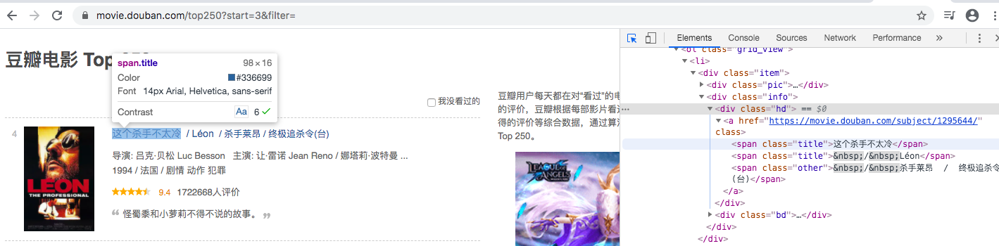

+ 目标：<b>爬取豆瓣top250部电影的信息:名称 评分 评价数 概况 链接</b>
movie.douban.com/top250

+ 电影编号url分析
1～25 https://movie.douban.com/top250
26～50 https://movie.douban.com/top250?start=25
以此类推 https://movie.douban.com/top250?start=50

+ 电影标题分析

+ 引入requests,bs4,re包
	+ html = requests.get(url, headers=headers)
	+ bs = BeautifulSoup(html.text, "html.parser")
	+ bs.find_all("div", class\_="item") 

+ 正则提取内容
	+ re.compile(r'\<a href="(.*?)">')
	+ findImgSrc = re.compile(r'\(.*)')
	+ findRank = re.compile(r'\(.*)')
	+ findDes = re.compile(r'\(.*?)')